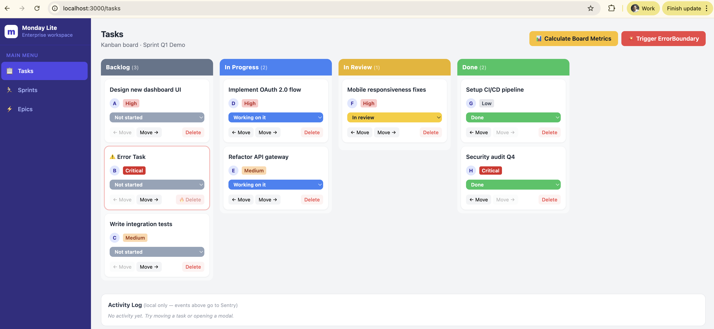
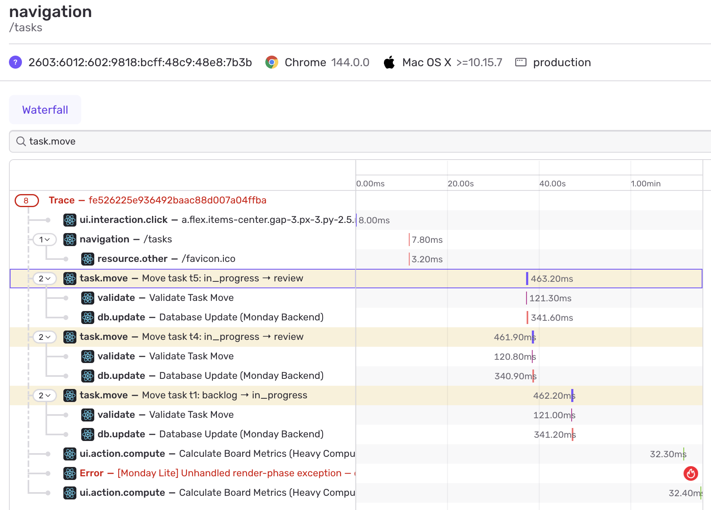
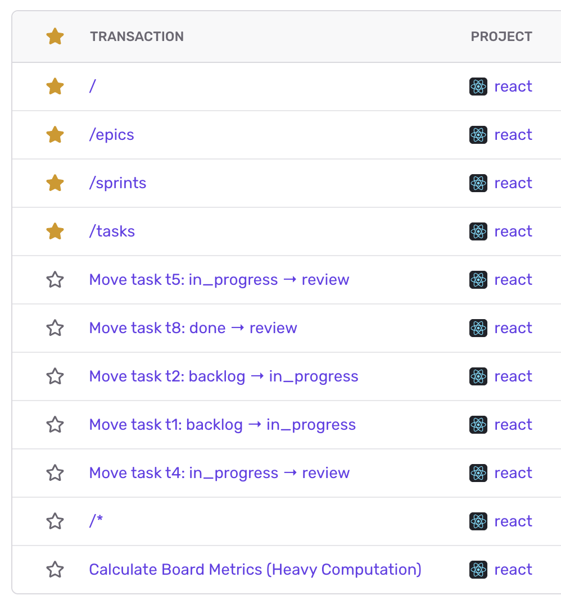

# Monday Lite — Sentry Demo App

A React board app built for demo'ing board productivity tools like task management and issues. Demonstrates automatic and manual Sentry instrumentation across errors, performance traces, breadcrumbs, context, and session replay.



<table><tr>
  <td></td>
  <td></td>
</tr></table>

---

## SETUP

**Requirements**

- Node.js 18+ (`node -v`)
- npm 9+ (`npm -v`)
- A Sentry account with a React project and a DSN

**Dependencies**

| Package | Purpose |
|---|---|
| `react` / `react-dom` 18 | UI framework |
| `react-scripts` 5 | CRA build toolchain |
| `@sentry/react` 8 | Sentry SDK — errors, performance, replay |
| `tailwindcss` 3 | Utility CSS |
| `autoprefixer` / `postcss` | Tailwind build pipeline |

**Install**

```bash
npm install
```

**Configure your DSN**

Open `src/App.js` and replace the `dsn` value at the top of `Sentry.init`:

```js
Sentry.init({
  dsn: 'https://YOUR_PUBLIC_KEY@oXXXXXXX.ingest.sentry.io/PROJECT_ID',
  ...
});
```

Your DSN is at **Sentry → Settings → Projects → [your project] → Client Keys (DSN)**.

---

## RUN

```bash
npm start
```

Opens the app at **http://localhost:3000**.

**Hot reload** is handled by Webpack Dev Server (included in `react-scripts`). Any change you save to a file in `src/` is reflected in the browser within 1–2 seconds without a full page refresh — no manual restart needed. Changes to `tailwind.config.js` or `postcss.config.js` require restarting the dev server.

**Production build**

```bash
npm run build
```

Outputs a minified bundle to `build/`. Serve it with any static host (`serve -s build`, Vercel, Netlify, etc.).

---

## Auto-instrumented vs. Custom-instrumented

### What Sentry instruments automatically

When you call `Sentry.init` with `browserTracingIntegration()` and `replayIntegration()`, the SDK hooks itself into the browser with no extra code from you:

| Signal | How it's captured |
|---|---|
| **Unhandled JS exceptions** | `window.onerror` + `unhandledrejection` listeners |
| **Page-load performance** | Captures the full page-load as a transaction with spans for DNS, TLS, TTFB, resource loads, etc. |
| **Navigation** | Each React route change becomes a new transaction |
| **HTTP requests** | `fetch` and `XMLHttpRequest` are monkey-patched — every outbound request gets a child span with URL, method, and status code |
| **Session Replay** | DOM mutations are recorded as a low-fidelity video. Starts automatically; always records when an error occurs (`replaysOnErrorSampleRate: 1.0`) |
| **`Sentry.ErrorBoundary`** | Any render-phase crash caught by the boundary is captured with a full stack trace, the breadcrumb trail, and the replay — automatically, because the boundary calls `captureException` internally |

### What was manually instrumented (and why)

Automatic instrumentation covers the edges of your app (network, navigation, crashes). Manual instrumentation covers the **inside** — the business logic that Sentry can't see on its own.

| Signal | Why it needed to be manual |
|---|---|
| **`task.move` parent span + `validate` / `db.update` child spans** | Sentry can see that a `fetch` was made, but it can't know that your code ran a validation step first, or what that validation checked. Wrapping each logical step in `startSpan` makes the trace tell the real story of what happened. |
| **`addBreadcrumb` on modal open** | The SDK records clicks and navigation, but it doesn't know that opening this specific modal is a meaningful user action in your domain. Naming the breadcrumb `"Opened item modal: Design new dashboard UI"` makes the trail human-readable when debugging. |
| **`addBreadcrumb` on status change** | Same rationale — a `<select>` change is just a DOM event to the SDK. The breadcrumb gives it business meaning. |
| **`captureException` on "Error Task" delete** | This error is intentionally swallowed (we show an alert instead of crashing). Without `captureException`, Sentry would never know it happened. Manual capture is required any time you handle an error gracefully but still want observability. |
| **`setTag("workspace_type", "enterprise")`** | The SDK has no way to know what tier this workspace is. Attaching it as a tag lets you filter Issues and Performance data by plan type across your entire customer base. |
| **`setContext("sprint_data", {...})`** | Rich domain context — sprint ID, goal, team velocity — that is meaningless to the SDK but invaluable to an engineer debugging a production issue at 2am. |
| **`startSpan` around `computeBoardMetrics`** | The function runs synchronously on the main thread. Without a span, the slowness is invisible in Sentry. Wrapping it produces a measurable entry in Performance → Interactions, with the exact duration and custom attributes. |

---

## App.js Sentry Implementation Map

| Section | Location in `src/App.js` | What it does |
|---|---|---|
| `Sentry.init` | Top of file, before any component | SDK bootstrap — enables BrowserTracing and Replay |
| `setTag / setContext` | Immediately after `Sentry.init` | Attaches workspace + sprint data to every event |
| `handleMoveTask` | `MondayLite` component | Parent `task.move` span wrapping two child spans |
| ↳ `validate` child span | Inside `handleMoveTask` | ~120ms simulated validation step |
| ↳ `db.update` child span | Inside `handleMoveTask` | ~340ms simulated network/DB write |
| `handleDeleteTask` | `MondayLite` component | `captureException` with scoped tags + context for "Error Task" |
| `handleOpenModal` | `MondayLite` component | `addBreadcrumb` with category `ui.modal` |
| `handleStatusChange` | `MondayLite` component | `addBreadcrumb` with category `ui.interaction` |
| `handleComputeMetrics` | `MondayLite` component | Slow `startSpan` with `op: ui.action.compute` |
| `Sentry.ErrorBoundary` | Root `App` export | Catches render-phase crashes, renders `ErrorFallback` |

---

## Demo Script

Walk engineers through the Sentry UI in this order — each step builds on the last.

**1. Issues tab — `captureException`**

Click the pulsing **🔥 Delete** button on the "Error Task" card. A `ProtectedTaskDeleteError` appears in Sentry Issues within seconds.

Open the issue and point to:
- **Tags sidebar** — `workspace_type: enterprise`, `action: delete_task`, `task.name: Error Task`
- **Contexts sidebar** — the full `sprint_data` and `task_info` objects
- **Breadcrumb trail** — if you opened a modal or changed a status before clicking Delete, those actions appear here as named, human-readable events

> *"Without those three lines of manual instrumentation, you'd see a stack trace and nothing else. With them, you know exactly what the user was doing, what workspace they're on, and what sprint the work belongs to."*

**2. Performance → Trace Explorer — nested custom spans**

Click any **← Move** or **Move →** button and wait ~500ms. Find the `task.move` transaction in Trace Explorer.

Open the waterfall and point to:
- The parent `task.move` span (~480ms total)
- The `validate` child span (~120ms)
- The `db.update` child span (~340ms)

> *"This is the diagram you draw on a whiteboard during an incident review — now it's in your production tooling automatically. You can see exactly where the time went inside a single user action."*

**3. Performance → Interactions / Web Vitals — slow span**

Click **📊 Calculate Board Metrics**. The UI freezes for 2–3 seconds.

In Sentry, find the `Calculate Board Metrics (Heavy Computation)` span under Performance → Interactions. Show the duration and the custom attributes (`board.columns`, `board.total_items`).

> *"This is how you find the expensive reducer, selector, or synchronous computation that's killing your board's INP — without guessing or adding `console.time` everywhere."*

**4. Session Replay**

Trigger any error (Delete "Error Task" or click **💥 Trigger ErrorBoundary**). Open the issue in Sentry and click **Replay** in the sidebar.

> *"Your support team or on-call engineer sees a pixel-perfect recording of everything the user did before the crash. No log spelunking, no 'can you reproduce it?' emails."*

**5. ErrorBoundary — graceful crash recovery**

Click **💥 Trigger ErrorBoundary**. The board is replaced by the recovery screen. In Sentry, a new issue appears with the full stack trace, breadcrumb trail, and a replay.

> *"The `Sentry.ErrorBoundary` component is a two-line change. You get a user-friendly recovery screen and a fully enriched error report for free — your engineers never have to write `try/catch` around render logic again."*

---

## Action → Sentry Signal Reference

| Action in the app | Signal in Sentry |
|---|---|
| **Move any task (← / →)** | `task.move` transaction with nested `validate` + `db.update` child spans in Trace Explorer |
| **Click a task title** | `ui.modal` breadcrumb on the breadcrumb trail of any subsequent error |
| **Change a status dropdown** | `ui.interaction` breadcrumb |
| **Open item modal, then change status inside it** | Two breadcrumbs in sequence — shows user journey leading up to an error |
| **🔥 Delete "Error Task"** | `ProtectedTaskDeleteError` in Issues with `task_info` context, `workspace_type` tag, and full breadcrumb trail |
| **📊 Calculate Board Metrics** | Long `ui.action.compute` span in Performance → Interactions (visible as high INP) |
| **💥 Trigger ErrorBoundary** | Unhandled render-phase error in Issues + Session Replay auto-attached |
| **Any error event** | `sprint_data` context and `workspace_type: enterprise` tag on every single event |
| **Any session with an error** | Session Replay recording auto-captured (`replaysOnErrorSampleRate: 1.0`) |
